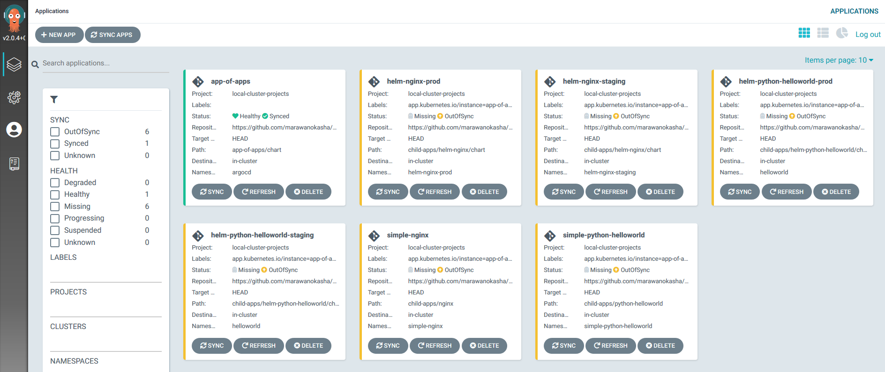

# ArgoCD Config App

Example for how to use a config app for deploying applications using Argo CD

The folder [`argocd-manifests`](./argocd-manifests) contains the definition of the app of apps and the project where it will be deployed. The actual application configurations can be found under [`app-of-apps`](./app-of-apps) which is a helm chart. The definitions for each child application can be found under [`child-apps`](./child-apps).

The Child applications included are:
- [python-helloworld](./child-apps/python-helloworld): Simple Python Hello world deployment, deployed using kubernetes manifests
- [helm-python-helloworld](./child-apps/helm-python-helloworld): Simple Python Hello world deployment, deployed using Helm
- [nginx](./child-apps/nginx): Nginx deployment + Service, deployed using kubernetes manifests
- [helm-nginx](./child-apps/helm-nginx): Nginx deployment + Service, deployed using Helm

## Deployment

1. Install Argocd in your kubernetes cluster in the namespace `argocd`. This will install the argocd application + CRDs we need.

    ```
    kubectl create namespace argocd
    kubectl apply -n argocd -f https://raw.githubusercontent.com/argoproj/argo-cd/stable/manifests/install.yaml
    ```

2. Install the ArgoCD project + App of Apps
    ```
    kubectl apply -f argocd-manifests/argocd-parent-project.yaml
    kubectl apply -f argocd-manifests/argocd-parent-application.yaml
    ```
    The ArgoCD project is optional, we could just use the default project, but we create a separate project to illustrate the different CRDs from ArgoCD.

    The App of Apps will be deployed by ArgoCD using Helm and will create the applications for the child Apps.

3. Sync the child Apps

    You can use the ArgoCD UI to sync the child apps, or use the CLI directly:

    ```
    argocd app sync -l app.kubernetes.io/instance=app-of-apps
    ```
    
